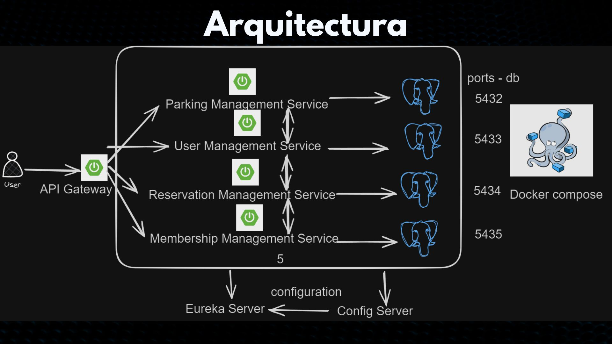
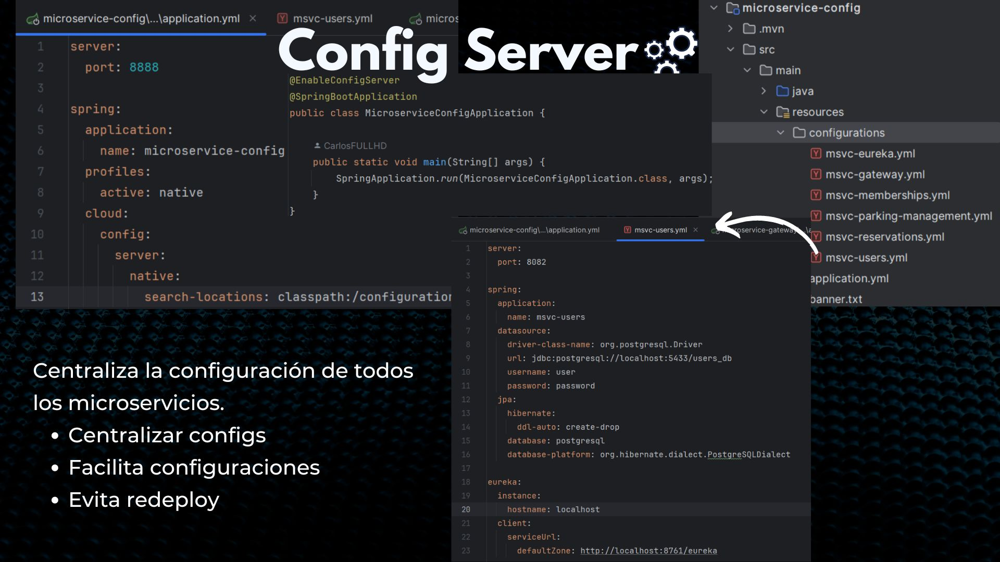
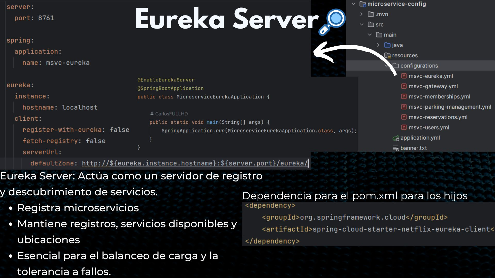
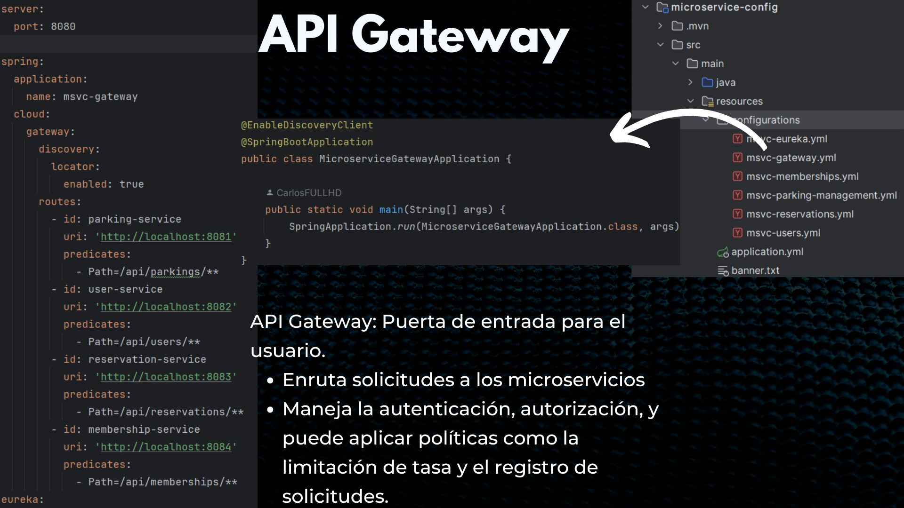
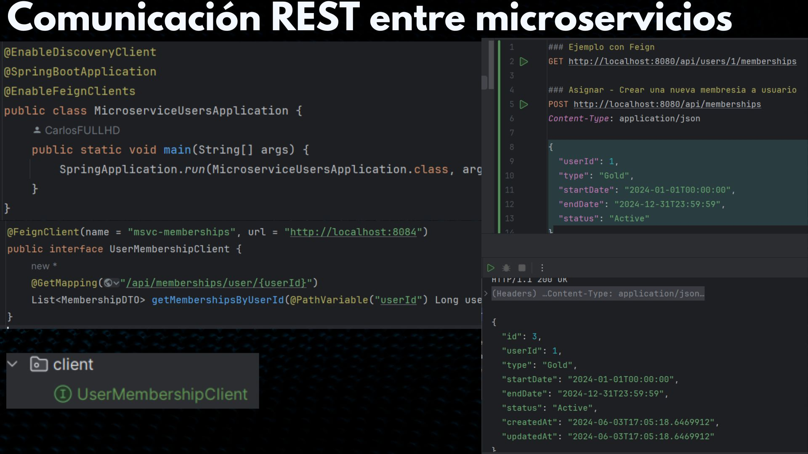

# Intelligent Parking Management System with Microservices - Spring Boot - Cloud

<details>
  <summary>Table of Contents</summary>

1. [Project Objective](#project-objective)

   - Optimize parking space management using IoT and AI.
   - Reduce search time, minimize traffic congestion, and decrease environmental impact.

2. [Architecture](#architecture)

   - Overview of the system's key components.

3. [Key Components](#key-components)

   - **Config Server**: Manages centralized configuration for all microservices.
   - **Eureka Server**: Service discovery and registration.
   - **API Gateway**: Routes client requests to microservices.
   - **Microservices**: Handles parking management, user management, reservation management, and membership management.

4. [Architecture Diagram](#architecture-diagram)

   - Visual representation of the system architecture.

5. [Communication Flow](#communication-flow)

   - Configuration retrieval, service registration, and request routing.

6. [Technologies Used](#technologies-used)

   - List of technologies: Spring Boot, Spring Cloud, Docker, PostgreSQL, Feign Client.

7. [Microservices Explanation](#microservices-explanation)

   - **API Gateway**: Entry point for all requests.
   - **Config Server**: Centralized configuration management.
   - **Eureka Server**: Service registry and discovery.
   - **Communication Between Microservices**: Use of Feign Client.

8. [Installation and Setup](#installation-and-setup)

   - Steps to set up and run the project.

9. [Running All Microservices](#running-all-microservices)
   - Instructions to start all microservices.
   </details>

## Project Objective

The **Intelligent Parking Management System** aims to optimize parking space management in urban areas using IoT technologies and AI algorithms. The project reduces the time spent searching for parking spots, minimizes traffic congestion, and decreases environmental impact through the use of sensors and voice recognition.

## Architecture

### Key Components

1. **Config Server**: Manages centralized configuration for all microservices.
2. **Eureka Server**: Discovery service that allows microservices to register and discover each other.
3. **API Gateway**: Handles all client requests and routes them to the appropriate microservices.
4. **Microservices**:
   - **Parking Management**: Manages information about parking lots and available spots.
   - **User Management**: Handles user information and roles.
   - **Reservation Management**: Manages parking space reservations by users.
   - **Membership Management**: Administers memberships and additional features offered to users.

### Architecture Diagram



### Communication Flow

1. **Config Server**: All microservices retrieve their configuration from the Config Server at startup.
2. **Eureka Server**: All microservices register with the Eureka Server for discovery.
3. **API Gateway**: Receives client requests and routes them to the appropriate microservices based on the path.
4. **Microservices**:
   - **User Management** can communicate with **Membership Management** using Feign Client to fetch memberships for a specific user.

### Technologies Used

- **Spring Boot**: Main framework for developing microservices.
- **Spring Cloud**: Includes Config Server, Eureka Server, and API Gateway.
- **Docker**: Containerization of applications and databases.
- **PostgreSQL**: Database management system used for each microservice.
- **Feign Client**: Inter-microservice communication.

## Microservices Explanation

### API Gateway



The API Gateway serves as the entry point for all client requests. It routes these requests to the appropriate microservices and handles authentication, authorization, and other cross-cutting concerns such as rate limiting and logging.

### Config Server



The Config Server centralizes the configuration of all microservices. This allows for easier management and updating of configurations without the need to redeploy the services. Configurations are stored in a central repository and fetched by the microservices at runtime.

### Eureka Server



The Eureka Server acts as a service registry and discovery server. It keeps track of all available microservices and their instances, enabling load balancing and failover mechanisms. Microservices register themselves with the Eureka Server at startup and periodically send heartbeats to indicate their availability.

### Communication Between Microservices



Microservices communicate with each other using RESTful APIs. The API Gateway routes incoming requests to the appropriate microservice. Internal communication between microservices is facilitated using Feign clients, which provide a declarative way of defining REST clients in Spring Boot.

## Installation and Setup

### Prerequisites

- Docker and Docker Compose installed.
- JDK 17 installed.

### Project Structure

```
spring-microservices/
├── config-server/
├── eureka-server/
├── api-gateway/
├── microservice-parking-management/
├── microservice-users/
├── microservice-reservations/
├── microservice-memberships/
├── docker-compose.yml
└── README.md
```

### Database Initialization Scripts

Each database has an initialization `.sql` file located in the `./init` directory. These files are copied to the `/docker-entrypoint-initdb.d/` directory in the PostgreSQL containers to create the necessary tables.

### Available Endpoints

#### Parking Management

- **GET** `/api/parkings`: Retrieve all parking lots.
- **POST** `/api/parkings`: Create a new parking lot.

#### User Management

- **GET** `/api/users`: Retrieve all users.
- **POST** `/api/users`: Create a new user.
- **GET** `/api/users/{id}/memberships`: Retrieve memberships for a user.

#### Reservation Management

- **GET** `/api/reservations`: Retrieve all reservations.
- **POST** `/api/reservations`: Create a new reservation.

#### Membership Management

- **GET** `/api/memberships`: Retrieve all memberships.
- **POST** `/api/memberships`: Create a new membership.

### Maven Configuration

The root `pom.xml` file includes the configuration for all microservices as modules and manages common dependencies.

#### Root pom.xml

The root `pom.xml` file lists all microservices as modules and includes common dependencies such as Spring Boot and Lombok.

#### Child pom.xml Example

Each microservice has its own `pom.xml` file, inheriting from the root `pom.xml` and specifying dependencies unique to that microservice.

### Starting the Services

1. **Clone the repository:**

   ```sh
   git clone https://github.com/CarlosFULLHD/spring-microservices.git
   cd spring-microservices
   ```

2. **Navigate to the docker-compose directory:**

   ```sh
   cd spring-microservices/docker-compose
   ```

3. **Build and start the containers:**

   ```sh
   docker-compose up -d
   ```

4. **Verify the containers are running:**

   ```sh
   docker-compose ps
   ```

### Running All Microservices

Once you have started the Docker containers for the databases, you can proceed to run the microservices. Follow these steps:

1. **Navigate to the root directory of the project:**

   ```sh
   cd spring-microservices
   ```

2. **Build and package all the microservices:**

   ```sh
   mvn clean package
   ```

3. **Start the Config Server:**

   ```sh
   cd config-server
   mvn spring-boot:run
   ```

4. **Start the Eureka Server:**

   Open a new terminal window and navigate to the Eureka Server directory:

   ```sh
   cd eureka-server
   mvn spring-boot:run
   ```

5. **Start the API Gateway:**

   Open another new terminal window and navigate to the API Gateway directory:

   ```sh
   cd api-gateway
   mvn spring-boot:run
   ```

6. **Start the Microservices:**

   For each microservice (Parking Management, User Management, Reservation Management, Membership Management), open a new terminal window and navigate to the respective directory, then run the service:

   ```sh
   # Parking Management Service
   cd microservice-parking-management
   mvn spring-boot:run

   # User Management Service
   cd microservice-users
   mvn spring-boot:run

   # Reservation Management Service
   cd microservice-reservations
   mvn spring-boot:run

   # Membership Management Service
   cd microservice-memberships
   mvn spring-boot:run
   ```
